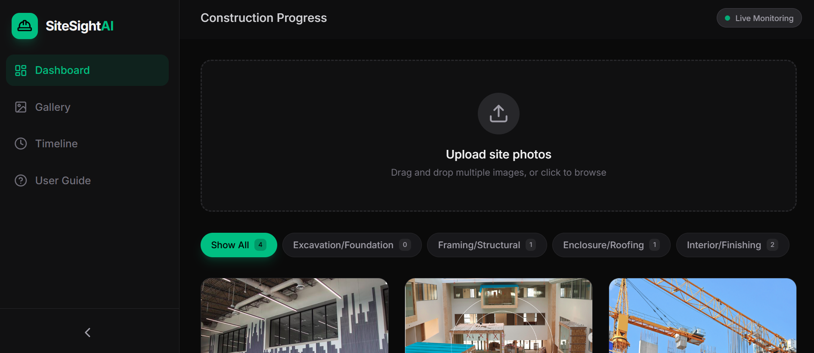
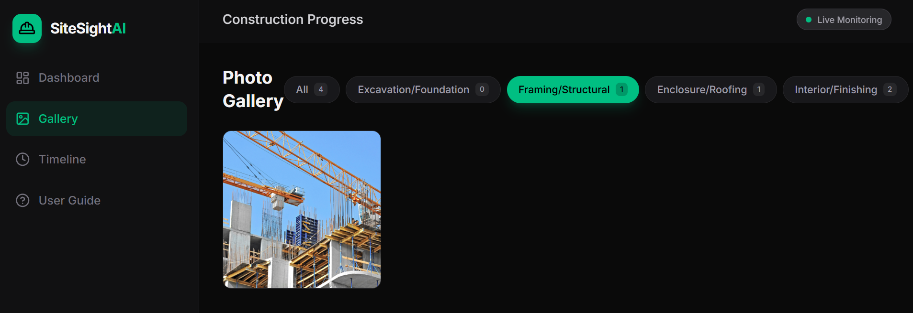

# SiteSight AI

SiteSight AI is an AI-powered construction progress tracker that automatically classifies site photos into project stages using Gemini AI.

<p align="center">
  
  
  
  
  
  
</p>

## Features
- **AI Classification**: Automatically categorizes site photos (Excavation, Framing, Enclosure, Interior).
- **Visual Insights**: Provides AI-generated technical insights for each photo.
- **Persistence**: Stores all project history in a local SQLite database.
- **Timeline View**: Track project evolution chronologically.

## Prerequisites
- **Node.js** (v18 or higher)
- **Python 3.12+** (for virtual environment)

## Setup and Run

### 1. Environment Setup

#### Activate Virtual Environment
On Windows (PowerShell):
```powershell
.\venv\Scripts\Activate.ps1
```

#### Install Dependencies
```bash
# Install Node.js dependencies
npm install

# Install Python dependencies (optional for main app, but recommended for completeness)
pip install -r requirements.txt
```

### 2. Configuration
Copy `.env.example` to `.env.local` and add your API key:
```env
GEMINI_API_KEY="your_api_key_here"
```

### 3. Run Locally
Start the development server:
```bash
npm run dev
```
The application will be available at [http://localhost:3000](http://localhost:3000).

---
---
